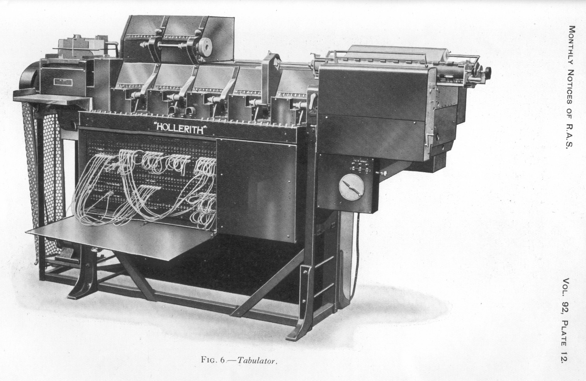

# 简介

> 计算机领域中的所有问题，都可以通过向上一层进行抽象封装来解决。

## 从穿孔纸带开始

编程最早可能来自于1801年发明的[雅卡尔织布机]，无论如何，那时候已经是用打孔卡片来“写程序”了。
1890 年美国人口普查，使用打孔卡片，相比于 1880 年用了七年实践，仅6周就完成了人口统计。
1906 年，引入了一种控制面板。通过修改排线来实现不同的功能。不过此时程序还是存储在物理卡片中。

直到 `可存储式电子计算机` 的发明后，数据和指令存到了一起。
为了让密密麻麻的0/1指令流方便阅读，1947年，Kathleen Booth 可能首次发明了汇编语言（Assembly language）的概念。

同年，领导 ENIAC 项目的 John Macuchly，就写文章描述了如何将主程序和磁带中一系列选定的子程序一起加载到计算机中，并通过将子程序代码重定位以反映实际被加载的地址。这可能是最早的链接器（linker）的概念。

操作系统（Operating System）则出现的更晚，知名的 UNIX 系统直到 1969 年左右才出现。
而C语言最早由丹尼斯·里奇（Dennis Ritchie）为了在 PDP-11 电脑上运行的Unix系统所设计出来的编程语言。

> 未完待续

[雅卡尔织布机]: https://en.wikipedia.org/wiki/Jacquard_machine
