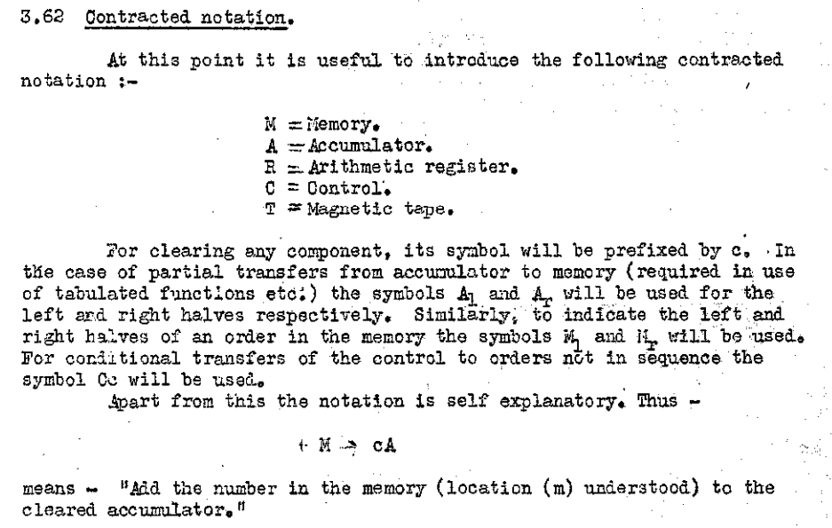
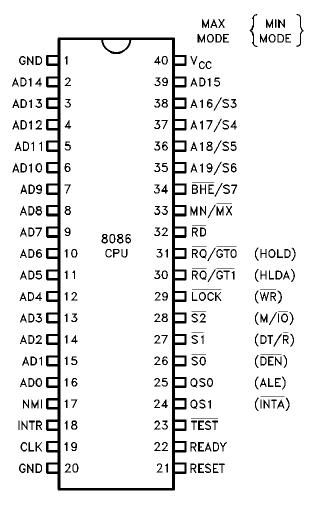
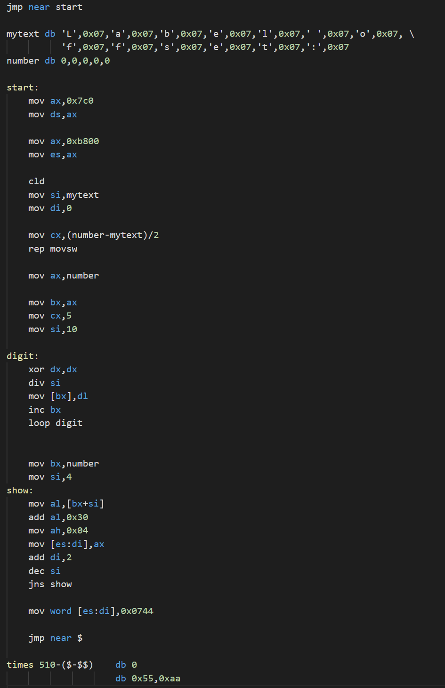

# ASM (Assembly language)

> 汇编语言

## 1.1 前言

本章节着重讲解 [`NASM`] (Netwide Assembler)。
当然，这个世界上还有很多其他汇编语言编译器（[`MASM`]、[`FASM`]、[`GOASM`]）。
但 [`NASM`] 可能是支持最广的 `x86` 编译器了：从 `16位` 到 `64位`、从 `Linux` 到 `Windows`。
另外，[`NASM`] 使用 `Intel` 汇编语法
<sup>[有什么区别？](../../references/asm-intel-vs-att-syntax.md)</sup>。

## 1.2 如何安装 [`NASM`]？

打开 [`NASM`] 官网，打开
[**download**](https://www.nasm.us/pub/nasm/releasebuilds)
一栏即可找到各种版本的二进制文件，本章节采用 `NASM v2.15.05` 版本。

因为 `NASM` 没有发布 `.deb` 预编译版本，`apt` 上的版本更新不及时，版本总是慢一拍，所以我们自己编译安装 `nasm`。

嫌麻烦的读者可以直接运行 `sudo apt update && sudo apt install nasm` 直接安装。

```zsh
$ tar -xf nasm-2.15.05.tar.gz

$ ls
nasm-2.15.05  nasm-2.15.05.tar.gz
$ cd nasm-2.15.05

$ ls
AUTHORS      Mkfiles            common        doc      nasm.spec      ndisasm.1    rdoff    version.h
CHANGES      README.md          config        headers  nasm.spec.in   ndisasm.txt  stdlib   version.mac
ChangeLog    SubmittingPatches  configure     include  nasm.spec.sed  ndisasm.xml  test     version.mak
INSTALL      asm                configure.ac  macros   nasm.txt       nsis         tools    version.pl
LICENSE      autoconf           contrib       misc     nasm.xml       output       travis   version.sed
Makefile.in  autogen.sh         disasm        nasm.1   nasmlib        perllib      version  x86
$ ./configure
# 生成 Makefile
$ make
# 编译项目
$ sudo make install
# 安装项目
make: Circular asm/warnings.c <- asm/warnings.time dependency dropped.
/usr/bin/mkdir -p /usr/local/bin
/usr/bin/install -c nasm /usr/local/bin/nasm
/usr/bin/install -c ndisasm /usr/local/bin/ndisasm
/usr/bin/mkdir -p /usr/local/share/man/man1
/usr/bin/install -c -m 644 ./nasm.1 /usr/local/share/man/man1/nasm.1
/usr/bin/install -c -m 644 ./ndisasm.1 /usr/local/share/man/man1/ndisasm.1
```

最后，`nasm` 被我们安装到了 `/usr/local/bin/nasm` 目录下：

```zsh
$ where nasm
/usr/local/bin/nasm
$ nasm -v
NASM version 2.15.05 compiled on Jan 10 2021
```

## 1.3 什么是汇编语言（Assembly language）？

正如任何高级语言，例如 `JavaScript`、`C++`，甚至是 `C` 语言，汇编语言起初也是也是为了方便程序员编程（现在不是了）。
因为 `可存储式电子计算机` 的发明而被 [Kathleen Booth] 的
[文章](http://mt-archive.info/Booth-1947.pdf) 中首次引入。
其表示了二进制数据与人类可阅读的符号一种映射关系。



例如如下代码，如果我们这时候观察 `eax` 寄存器，显而易见的，根据 `nasm` 语法，那么 `eax` 寄存器此时会得到结果为11。

```asm
mov eax, 5  ; 将 5 移动到 eax 寄存器
add eax, 6  ; 将 6 与 eax 寄存器的内容相加，结果保存在其中
```

当然，那篇文章已经是近乎八十年前的东西了。我们如何在现代的操作系统中模拟一套汇编语言的环境，体验上世纪程序员直接读取内存的体验呢？

## 1.4 QEMU —— 虚拟化计算机

类似 Apple M1 芯片下的 [`Rosetta 2`]，[`QEMU`] 是一个开源软件，其专门模拟许多架构（例如本章节使用的 `x86` 架构）到其他架构的电脑上。

## 1.5 X86遗产 —— 8086 通用处理器



## 1.6 用什么编辑器来写汇编？

笔者使用 `Visual Studio Code`，下载插件 [`x86 and x86_64 Assembly`] 后即可高亮 `nasm` 格式的代码文件



[`MASM`]: https://docs.microsoft.com/en-us/cpp/assembler/masm/masm-for-x64-ml64-exe?view=msvc-160

[`NASM`]: https://www.nasm.us/

[`FASM`]: https://flatassembler.net/

[`GOASM`]: http://www.godevtool.com/

[Kathleen Booth]: https://en.wikipedia.org/wiki/Kathleen_Booth

[`Rosetta 2`]: https://developer.apple.com/documentation/apple_silicon/about_the_rosetta_translation_environment

[`QEMU`]: https://www.qemu.org/

[`x86 and x86_64 Assembly`]: https://marketplace.visualstudio.com/items?itemName=13xforever.language-x86-64-assembly
