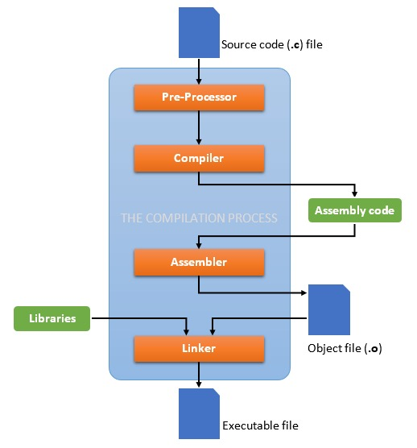

# LD

## 基本概念

`linker` 组合一系列的输入文件到单个的输出文件。输出文件和每个输入文件称为 `对象(object)` 文件。

输出文件通常成为 `可执行文件(executable)`，但我们还称其为 `object` 文件。
除其他东西外，每个 `object` 文件都有一系列的 `段(sections)`。
我们有时将输入文件中的段称作 `输入段(input section)`；同样的，输出文件中的段成为 `输出段(output section)`。

每个 `object` 文件都有一个 `名字(name)` 和一个 `大小(size)`。大多数段都与一组数据关联，称为 `段内容(section contents)`。
一个段可能被标记为 `可加载(loadable)`，意思是输出文件运行时会被加载到内存中。
一个没有内容的段可能被标记为 `可分配(allocatable)`，意思是内存中应该留出这一块区域，但是没有指定的内容（一些情况下应该清零内存）。
一个既不可加载也不可分配的段包含了一些特殊的各种各样的调试信息。

每个可加载或可分配的输出段都有两个地址，第一个是 `VMA(virtual memory address)`，这个地址是当输出文件运行时该段将有的地址。
第二个地址是 `LMA(load memory address)`，这是该段将会被加载的地址。
大多数情况下，这两个地址是一样的。
一个他们不一样时候的例子是当数据被加载到ROM中，然后当程序启动时被加载到RAM中（这种技术通常用于基于ROM的系统初始化全局变量）。
这种情况下ROM地址是LMA，RAM地址是VMA。

你可以通过 `objdump -h` 来查看一个对象文件中的段。

同样的，每个对象文件都有一个 `符号(symbols)` 的列表。一个符号可能是定义的，或者未定义的。每个符号都有名字，每个被定义的符号都有地址，和其他信息。
如果你把 `C` 或 `C++` 程序编译到对象文件中，你会发现每个定义了的函数和全局、静态变量都有一个已定义的符号。每个输入文件中未定义的函数和全局变量都会变成未定义的符号。

你可以通过 `nm` 来查看对象文件中的符号表，或者 `objdump -t`。

---

`ld` 通过组合一系列的 `object` 和 `架构` 文件，重定位他们的数据与绑定的符号引用。

通常， `ld` 是编译的最后一步。

`.text`: 程序代码
`.rodata`: 只读数据
`.data`: 可读、可写已初始化数据
`.bss`: 可读、可写未初始化数据

## References

<https://sourceware.org/binutils/docs/ld>

<http://wen00072.github.io/blog/2014/03/14/study-on-the-linker-script>

<https://sourceware.org/binutils/docs/binutils/objdump.html>
