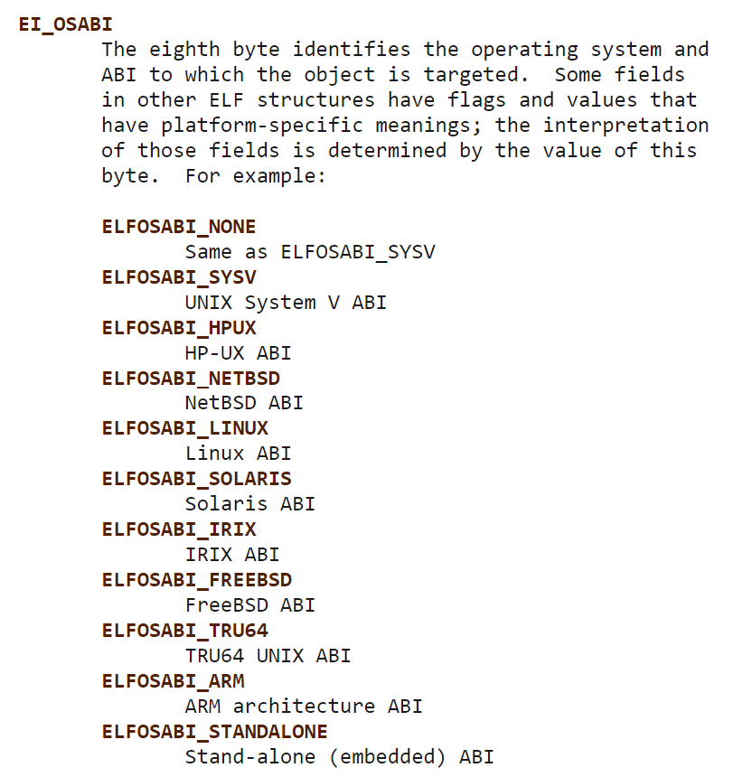
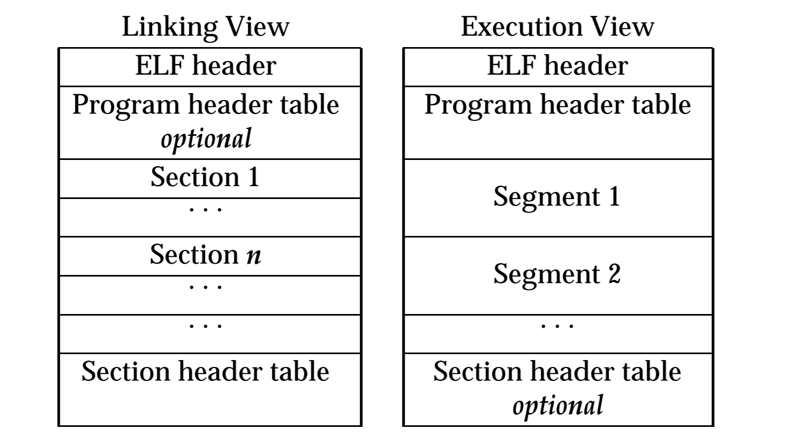

# 目标文件里有什么

## 格式

```zsh
$ make log
file ./1-shared.out
./1-shared.out: ELF 64-bit LSB shared object, x86-64, version 1 (SYSV), dynamically linked, interpreter /lib64/ld-linux-x86-64.so.2, BuildID[sha1]=6d0cc2cdda91ddc616fd82d647913c2b461bc113, for GNU/Linux 3.2.0, not stripped
file ./1-static.out
./1-static.out: ELF 64-bit LSB executable, x86-64, version 1 (GNU/Linux), statically linked, BuildID[sha1]=10ae5e6d1b32d3922e7849a7765a1591a893d089, for GNU/Linux 3.2.0, not stripped
```

`SYSV` 指的是 `UNIX System V`。
这里为什么是 `SYSV` 而不是 Linux 呢？因为 `e_ident[EI_OSABI]` 为 `0x00` 时候不指定操作系统，所以为 `SYSV`。

[](https://www.man7.org/linux/man-pages/man5/elf.5.html)

操作系统需要保护用户的代码不被篡改（当然有办法修改，例如
`Windows API` 的 `ReadProcessMemory` `WriteProcessMemory` `VirtualProtect`）

## `64` 位 `Linux` 下的 `SimpleSection.o`

```zsh
$ objdump -h ./SimpleSection.o

./SimpleSection.o:     file format elf64-x86-64

Sections:
Idx Name          Size      VMA               LMA               File off  Algn
  0 .text         0000005f  0000000000000000  0000000000000000  00000040  2**0
                  CONTENTS, ALLOC, LOAD, RELOC, READONLY, CODE
  1 .data         00000008  0000000000000000  0000000000000000  000000a0  2**2
                  CONTENTS, ALLOC, LOAD, DATA
  2 .bss          00000004  0000000000000000  0000000000000000  000000a8  2**2
                  ALLOC
  3 .rodata       00000004  0000000000000000  0000000000000000  000000a8  2**0
                  CONTENTS, ALLOC, LOAD, READONLY, DATA
  4 .comment      0000002b  0000000000000000  0000000000000000  000000ac  2**0
                  CONTENTS, READONLY
  5 .note.GNU-stack 00000000  0000000000000000  0000000000000000  000000d7  2**0
                  CONTENTS, READONLY
  6 .note.gnu.property 00000020  0000000000000000  0000000000000000  000000d8  2**3
                  CONTENTS, ALLOC, LOAD, READONLY, DATA
  7 .eh_frame     00000058  0000000000000000  0000000000000000  000000f8  2**3
                  CONTENTS, ALLOC, LOAD, RELOC, READONLY, DATA
```

`File off` 指的是在文件中的偏移量，`VMA` 指的是 `虚拟内存地址(Virtual memory address)`。
`LMA` 指的是 `装载内存地址（Load Memory Address）`。
<sup>[这是什么？](../../../doc/gnu-toolchain/linker-scripts/README.md)</sup>

```zsh
$ size ./SimpleSection.o
   text    data     bss     dec     hex filename
    219       8       4     231      e7 ./SimpleSection.o
```

与书中相比，发行代码段变长了。

## `ELF` 格式

`ELF`，全称为 `Executable and Linkable Format`



## 参考

`ELF` 格式官方文档：<http://www.skyfree.org/linux/references/ELF_Format.pdf>

[为什么？]: https://www.man7.org/linux/man-pages/man5/elf.5.html

[分页]: https://wiki.osdev.org/Paging
